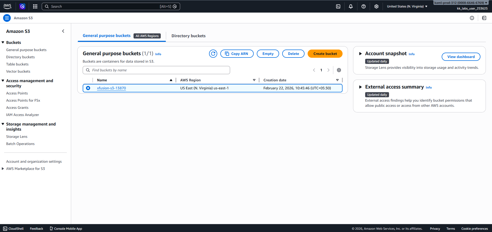

# Day 4: Enable Versioning for S3 Bucket

Data protection and recovery are fundamental aspects of data management. It's essential to have systems in place to ensure that data can be recovered in case of accidental deletion or corruption. The DevOps team has received a requirement for implementing such measures for one of the S3 buckets they are managing.

The s3 bucket name is xfusion-s3-13870, enable versioning for this bucket.

✅ Method 1: Using the AWS Management Console

1. Sign in to the AWS Management Console and open the Amazon S3 console.

2. Select the desired bucket from the Buckets list.
3. Navigate to the Properties tab.

4. Scroll down to find the Bucket Versioning section and select Edit.

5. Choose Enable.
6. Select Save changes to apply the setting

✅ Method 2: Using the AWS CLI

Ensure you have the AWS CLI installed and configured with appropriate permissions. Then, run the following command, replacing bucket-name with your actual bucket name:

```
aws s3api put-bucket-versioning --bucket bucket-name --versioning-configuration Status=Enabled
```